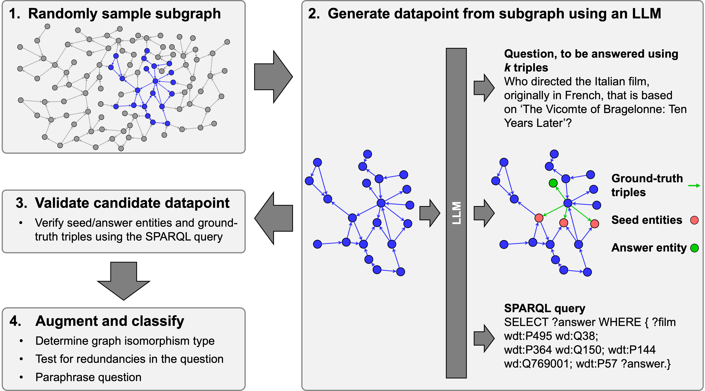

# SynthKGQA

SynthKGQA is a framework to generate large, high-quality, synthetic Knowledge Graph Question Answering datasets from any KG, using LLMs.


<div align="center">
<figure>
  
</figure>
</div>

This repository contains the code to reproduce the results of the paper [Ground-Truth Subgraphs for Better Training and Evaluation of Knowledge Graph Augmented LLMs](https://arxiv.org/abs/2511.04473).

## Setup

```
python3.10 -m venv .venv
source .venv/bin/activate
pip install -e .
pip install -U dgl -f https://data.dgl.ai/wheels/torch-2.4/repo.html
```

## SynthKGQA: KGQA dataset generation

For the required data format to store the KG, see this preprocessing [notebook](notebooks/paper_analysis.ipynb).

### Steps 1-2: candidate generation
```bash
python3 synth_kgqa/generate.py --kg-path <path to KG directory> --num-samples <number of questions to generate> --num-edges <number of edges in answer subgraphs> --save-path <path to output>
```
for generating a set of question-answer graph pairs based on the provided knowledge graph. See [synth_kgqa/parse.py](./synth_kgqa/parse.py) for additional parameters and [synth_kgqa/llm.py](./synth_kgqa/llm.py) for the supported LLM APIs. If you use OpenAI models, set the `OPENAI_KEY` environment key.

### Steps 3-4: candidate validation, classification and augmentation
```bash
python3 synth_kgqa/process_qa.py --kg-path <path to KG directory> --qa-path <save-path of generate.py>
```

The final data will be stored in `<save-path>/processed_qa.json`.

To construct question-specific subgraphs for the generated questions (Appendix C.1) and shortest path between seed and answer nodes, run
```bash
python3 synth_kgqa/compute_neighs_and_sp.py --kg-path <path to KG directory> --dataset <path to output of process_qa.py>
```

The output will be stored in `<save-path>/<dataset>_scores.pkl`. This computation can be expensive on larger KGs; see optional arguments in `compute_neighs_and_sp.py` for parallel processing of the dataset.

## GTSQA

Using the SynthKGQA framework and the [ogbl-wikikg2](https://ogb.stanford.edu/docs/linkprop/#ogbl-wikikg2) KG (CC-0 license), we constructed GTSQA, a KGQA dataset containing 30,144 training questions and 1622 test questions. It is made available under the [Creative Commons 4.0 license](https://creativecommons.org/licenses/by/4.0/deed.en), and can be found on Hugging Face: https://huggingface.co/datasets/Graphcore/GTSQA

```python
from datasets import load_dataset

gtsqa = load_dataset("Graphcore/GTSQA")
```

More details and statistics on the dataset are available in the [paper](https://arxiv.org/abs/2511.04473).

See [this notebook](notebooks/preporcess_wikikg2.ipynb) for the preprocessing steps of ogbl-wikikg2 and [this notebook](notebooks/gtsqa.ipynb) for the final post-processing steps applied to collate the data. 

The question-specific subgraphs of ogbl-wikikg2 generated with `synth_kgqa/compute_neighs_and_sp.py` can also be downloaded with the dataset, by using the alternative config:

```python
gtsqa = load_dataset("Graphcore/GTSQA", name="gtsqa-with-graphs")
```

## KG-RAG benchmarks

The code to benchmark the KG-RAG models evaluated in the paper on GTSQA is available in [benchmarks/](benchmarks/)

We also provide a [notebook](notebooks/paper_analysis.ipynb) to reproduce the analysis and generate the figures from the paper.

## How to cite

When referring to this work, please cite our paper.

```
@misc{cattaneo2025,
      title={Ground-Truth Subgraphs for Better Training and Evaluation of Knowledge Graph Augmented LLMs}, 
      author={Alberto Cattaneo and Carlo Luschi and Daniel Justus},
      year={2025},
      eprint={2511.04473},
      archivePrefix={arXiv},
      primaryClass={cs.LG},
      url={https://arxiv.org/abs/2511.04473}, 
}
```

## License

Copyright (c) 2025 Graphcore Ltd. Licensed under the MIT License.

The included code is released under the MIT license (see [details of the license](LICENSE)).

See [NOTICE.md](Notice.md) for further details.